# AREP Lab 6 - Reflection, IoC Pattern, and Meta Object Protocols in Java

This project was developed for the Application Server Architectures Workshop focused on reflection, annotations, IoC, and meta object protocols in Java. The main goal of the lab is to build a minimal reflective framework capable of loading a POJO from the command line, discovering methods annotated with @GetMapping, and invoking them dynamically as application services. The project also includes additional reflection examples, such as invoking a class main method dynamically and running simple custom tests through annotations, in order to demonstrate the reflective capabilities of Java in a clear and practical way.

# Getting Started

These instructions will get you a copy of the project up and running on your local machine for development and testing purposes. The project is built with Maven and uses Java reflection to discover and invoke services dynamically.

# Prerequisites

What things you need to install the software and how to install them.

- Java Development Kit (JDK) 21
- Apache Maven 3.8 or higher
- Git
- An IDE such as Visual Studio Code, IntelliJ IDEA, or Eclipse
- A terminal such as PowerShell, Git Bash, or the integrated terminal in your IDE

Check Java version:

```bash
java -version
````

Check Maven version:

```bash
mvn -version
```

Check Git version:

```bash
git --version
```

# Installing

A step by step series of examples that tell you how to get a development environment running.

Clone the repository.

```bash
git clone https://github.com/daviidc29/lab6-Arep
cd lab6-Arep
```

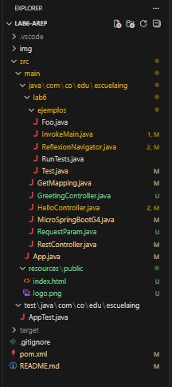


Compile the project and generate the build artifacts.

```bash
mvn clean package
```
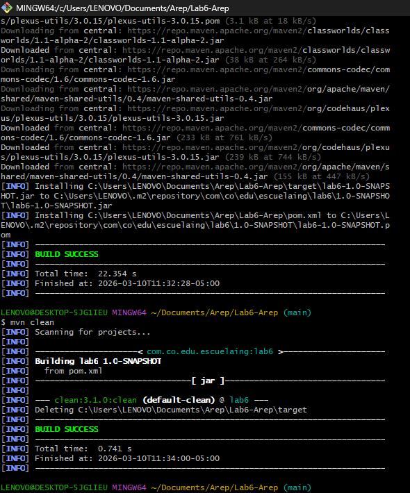

Run the reflection example that dynamically invokes the main method of another class.

```bash
java -cp target/classes com.co.edu.escuelaing.lab6.ejemplos.InvokeMain com.co.edu.escuelaing.lab6.ejemplos.ReflexionNavigator
```

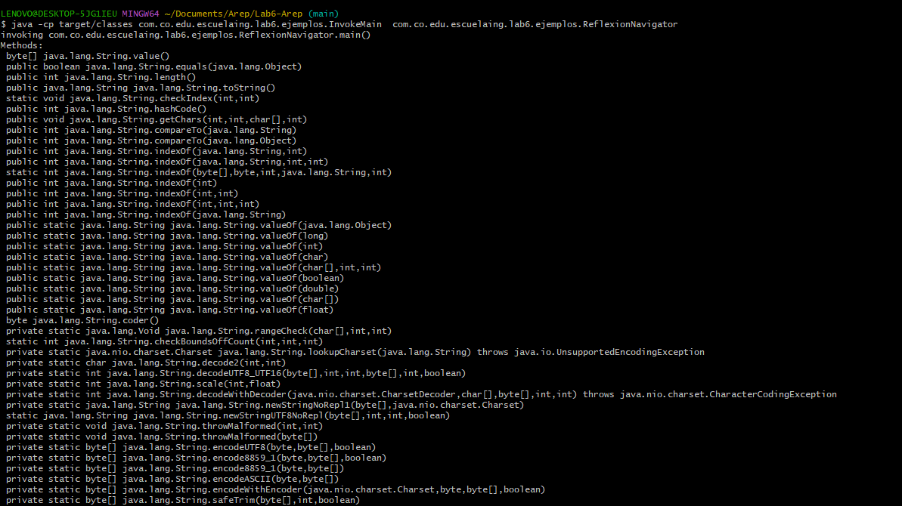


Run the custom annotation-based test framework.

```bash
java -cp target/classes com.co.edu.escuelaing.lab6.ejemplos.RunTests com.co.edu.escuelaing.lab6.ejemplos.Foo
```

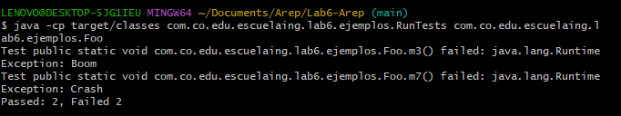


Run the reflective IoC prototype with the example controller and invoke the root endpoint.

```bash
java -cp target/classes com.co.edu.escuelaing.lab6.MicroSpringBootG4 com.co.edu.escuelaing.lab6.HelloController /root
```

Expected output:

```text
Greetings from Spring Boot!
```

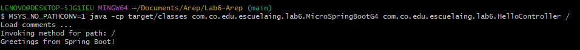

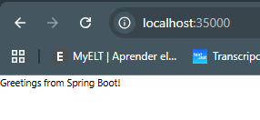

Run the `/pi` service.

```bash
java -cp target/classes com.co.edu.escuelaing.lab6.MicroSpringBootG4 com.co.edu.escuelaing.lab6.HelloController /pi
```

Expected output:

```text
PI=3.141592653589793
```

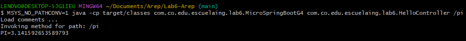

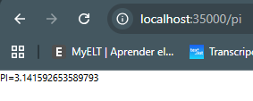


Run the `/hello` service.

```bash
java -cp target/classes com.co.edu.escuelaing.lab6.MicroSpringBootG4 com.co.edu.escuelaing.lab6.HelloController /hello
```

Expected output:

```text
Hello World!
```

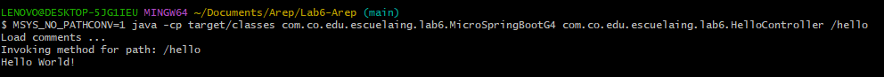

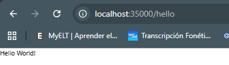

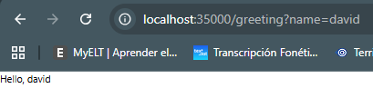

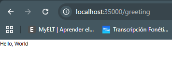

A simple demo sequence is:

```bash
mvn clean package
java -cp target/classes com.co.edu.escuelaing.lab6.MicroSpringBootG4 com.co.edu.escuelaing.lab6.HelloController /
java -cp target/classes com.co.edu.escuelaing.lab6.MicroSpringBootG4 com.co.edu.escuelaing.lab6.HelloController /pi
java -cp target/classes com.co.edu.escuelaing.lab6.MicroSpringBootG4 com.co.edu.escuelaing.lab6.HelloController /hello
```

This demo proves that the framework can load a bean from the command line, discover annotated methods, and execute different services dynamically.

# Running the tests

This project includes a basic Maven/JUnit test suite and also a custom reflection-based test runner example created as part of the lab. The automated Maven tests can be executed with the standard Maven test lifecycle command.

```bash
mvn test
```


## Break down into end to end tests

The project also contains end-to-end style manual validation commands that test the reflective behavior of the application from start to finish. These tests are important because they verify the main learning objectives of the lab: dynamic class loading, annotation discovery, reflective invocation, and route resolution.


Reflection navigation test:

```bash
java -cp target/classes com.co.edu.escuelaing.lab6.ejemplos.InvokeMain com.co.edu.escuelaing.lab6.ejemplos.ReflexionNavigator
```

Custom test execution example:

```bash
java -cp target/classes com.co.edu.escuelaing.lab6.ejemplos.RunTests com.co.edu.escuelaing.lab6.ejemplos.Foo
```

Reflective service invocation example:

```bash
java -cp target/classes com.co.edu.escuelaing.lab6.MicroSpringBootG4 com.co.edu.escuelaing.lab6.HelloController /hello
```

These commands validate the core reflective workflow of the project.

## And coding style tests

This project does not currently include a dedicated static code style tool such as Checkstyle or SpotBugs. At the moment, code quality is validated mainly through successful compilation, Maven build execution, and the clarity of the project structure. For this lab, the emphasis is on correctness of reflective behavior and Maven lifecycle management.

A practical code-quality validation command is:

```bash
mvn clean verify
```

This command ensures that the project builds cleanly and that the configured lifecycle phases are executed correctly.

# Deployment

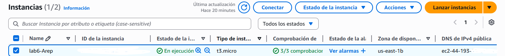

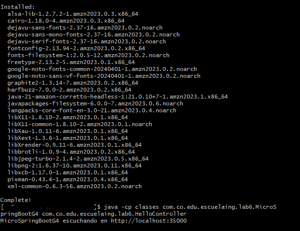

This image should prove that the application was deployed on AWS infrastructure.

This image should prove that the application was compiled and executed on the remote server.

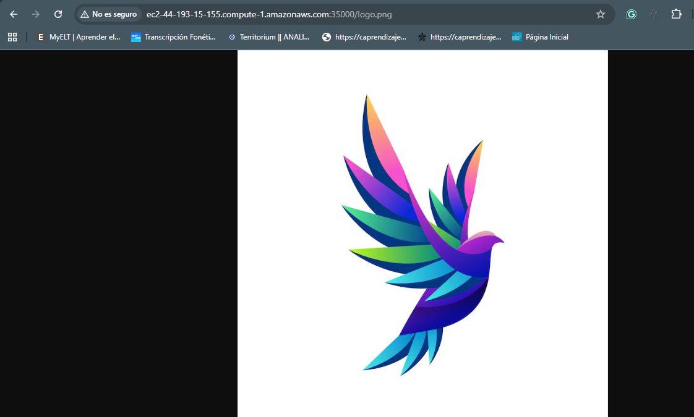


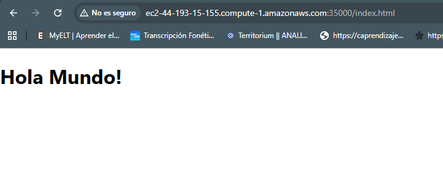

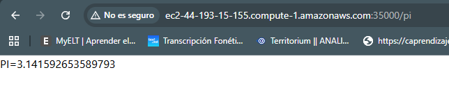

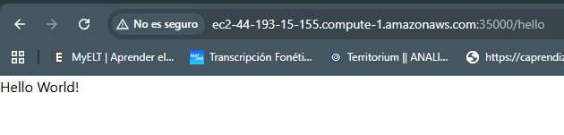

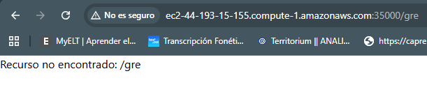

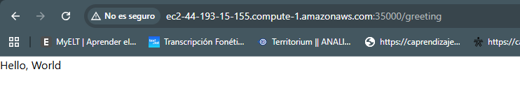

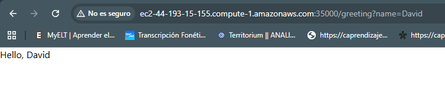


These images should prove that the reflective framework worked correctly after deployment.


# Built With

* Java 21 - Main programming language used to implement the reflective framework and examples
* Maven - Dependency management and project lifecycle management
* Java Reflection API - Used to load classes dynamically, inspect annotations, and invoke methods
* JUnit 4.11 - Used for the basic automated test structure included in the project
* AWS EC2 - Suggested deployment environment for the required final evidence

# Contributing

Please read CONTRIBUTING.md for details on the code of conduct and the process for submitting pull requests to this project. If it does not exist, you can create it.

# Versioning

We use SemVer for versioning. For the versions available, see the tags on this repository.

# Authors

* David Santiago Castro - Initial work

See also the list of contributors who participated in this project.

# License

This project is licensed under the MIT License - see the LICENSE.md file for details.

# Acknowledgments

* Escuela Colombiana de Ingeniería Julio Garavito for the academic context of the workshop
* The AREP course for the lab statement and requirements
* Oracle Java Tutorials for the conceptual basis on reflection and annotations
* Maven for providing the project structure and lifecycle tooling
* Inspiration from lightweight IoC and web framework ideas based on Java reflection

